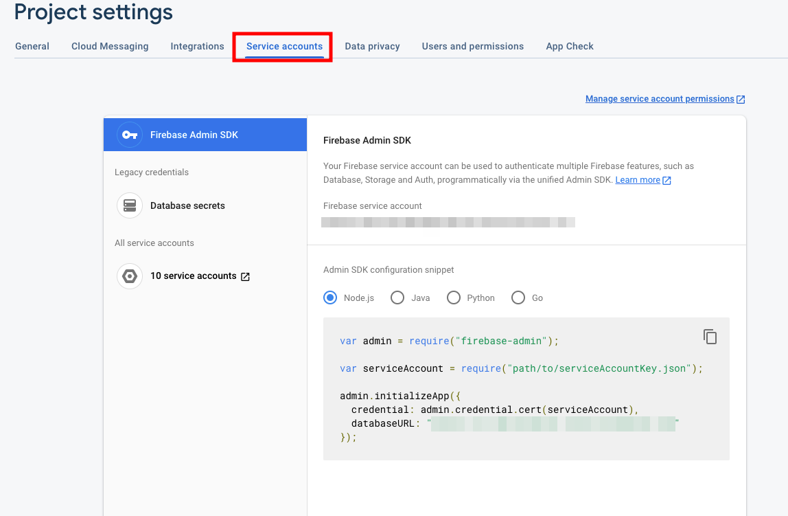
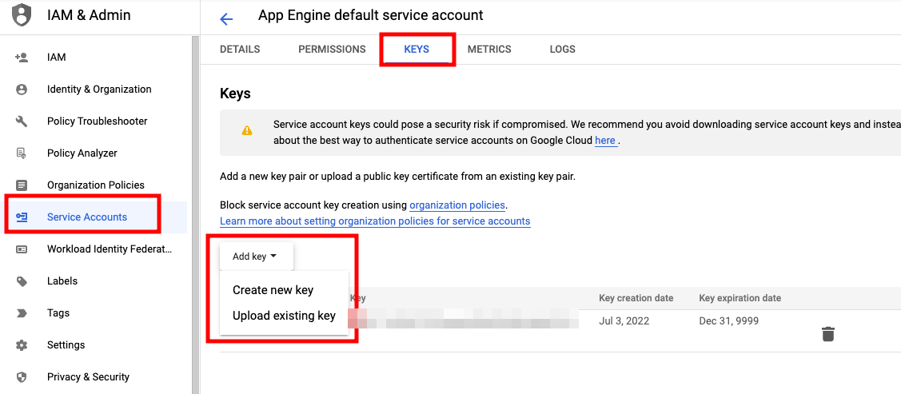

# Firebase Functions GraphQL Server
This is a implementation for creating [firebase functions](https://www.npmjs.com/package/firebase-functions) and accessing [realtime database](https://firebase.google.com/docs/database) with a [GraphQL](https://graphql.org/) Typescript server. 


> Notice: `Firebase Functions` is only accessible when you are under a [Blaze](https://firebase.google.com/pricing) (Pay as you go) plan. You also need to enable [Artifact Registry API](https://console.cloud.google.com/apis/api/artifactregistry.googleapis.com/metrics?project=fr-gql) in order to deploy this function successfully.

## Prerequisite
Initialize a new Firebase Functions Project through [Firebase CLI](https://firebase.google.com/docs/cli).
```bash
# To create a new project folder manually, you need to run firebase script inside a existing folder
mkdir new-app
cd new-app

# Initialize firebase project with script.
firebase init

# Choose Functions by using space, hit enter key to confirm and wait it to be finished. Choose Typescript for this sample code.
```

## Usage
Copy the this repo root file structure to your initialized firebase `functions` folder. For convenience, you could also check below scripts.
```bash
git clone https://github.com/vincecao/firebase-functions-graphql-server.git
mv functions functions.bak
mv firebase-functions-graphql-server functions
cd functions
# install dependencies
yarn
```

## Modify Repo Service Account Key and Database URL
Referring [database_environment.sample.json](./src/database_environment.sample.json), you need to create a `./src/database_environment.json` file with your `database URL` and `private service account key` of your firebase project.

- `database_url` could be found in `Your Project => Settings => ServiceAccounts => AdminSDK` inside firebase site.




- `account_key` could be found at google cloud site ([https://console.cloud.google.com/iam-admin/serviceaccounts](https://console.cloud.google.com/iam-admin/serviceaccounts))



Below is an sample structure of `./src/database_environment.json` file.
```json
{
  "database_url": "https://xxxxx.firebaseio.com",
  "account_key": {
    "type": "service_account",
    "project_id": "xxxxx",
    "private_key_id": "xxxx",
    "private_key": "xxx",
    "client_email": "xx@appspot.gserviceaccount.com",
    "client_id": "xxx",
    "auth_uri": "https://accounts.google.com/o/oauth2/auth",
    "token_uri": "https://oauth2.googleapis.com/token",
    "auth_provider_x509_cert_url": "https://www.googleapis.com/oauth2/v1/certs",
    "client_x509_cert_url": "https://www.googleapis.com/robot/v1/metadata/x509/xxx%40appspot.gserviceaccount.com"
  }
}
```

## Have a try on your GraphQL server
You could import below sample JSON file in realtime database by testing this repo demo server.


```json
{
  "cats": {
    "abyssinian": {
      "description": "The Abyssinian is a breed of domestic short-haired cat with a distinctive \"ticked\" tabby coat, in which individual hairs are banded with different colors. They are also known simply as Abys. The breed is named for Abyssinia, where it is believed to have originated.",
      "lifespan": "14-15 years",
      "name": "Abyssinian"
    },
    "american_bobtail": {
      "description": "The American Bobtail is an uncommon breed of domestic cat which was developed in the late 1960s. It is most notable for its stubby \"bobbed\" tail about one-third to one-half the length of a normal cat's tail.",
      "lifespan": "13-18 years",
      "name": "American Bobtail"
    }
  }
}
```

Run a demo preview in your local code environment. 

**Option 1**: `5000` is a default port for serve but MacOS using it for AirPlay. Thus, using port 5004 for preview script.

```bash
yarn preview:production
# script for `yarn build && firebase serve -p 5004`
```

**Option 2**: update `../firebase.json` of parent folder as below and run your firebase `emulators`.
```json
"emulators": {
    "hosting": {
      "port": 5004
    }
  }
```

## Modify your own GraphQL type with realtime Database
Replacing `typeDefs` and `resolvers` inside `./src/index.ts`.

## Deploy to Firebase
```bash
yarn deploy
```

## License
MIT

### Reference
- [GraphQL Server Using Firebase Functions](https://www.youtube.com/watch?v=I5irZ0AAr98)
- [How can i generate private key for firebase admin sdk?](https://stackoverflow.com/questions/72838290/how-can-i-generate-private-key-for-firebase-admin-sdk)
- [Firebase serve error: Port 5000 is not open. Could not start functions emulator](https://stackoverflow.com/questions/57537355/firebase-serve-error-port-5000-is-not-open-could-not-start-functions-emulator)
